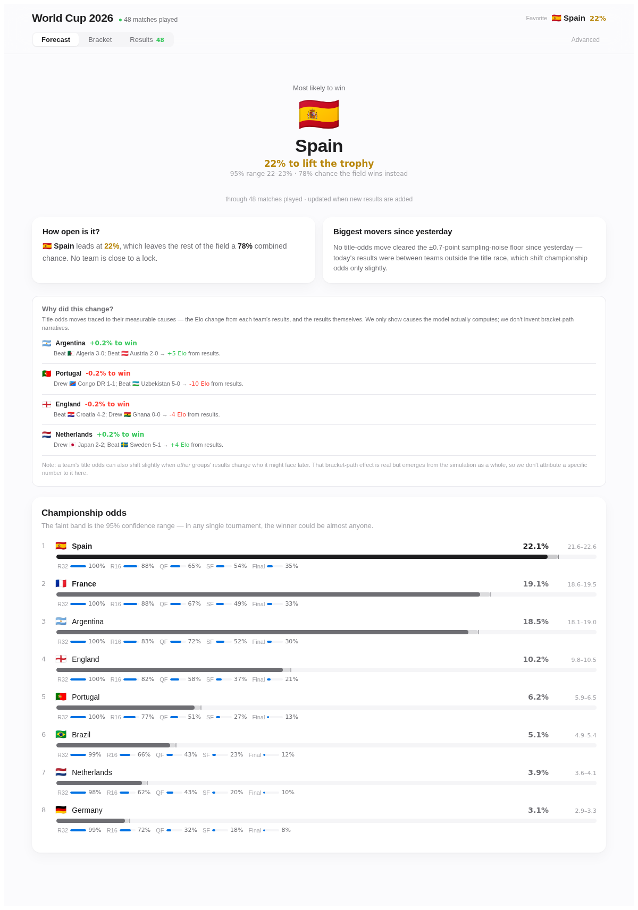
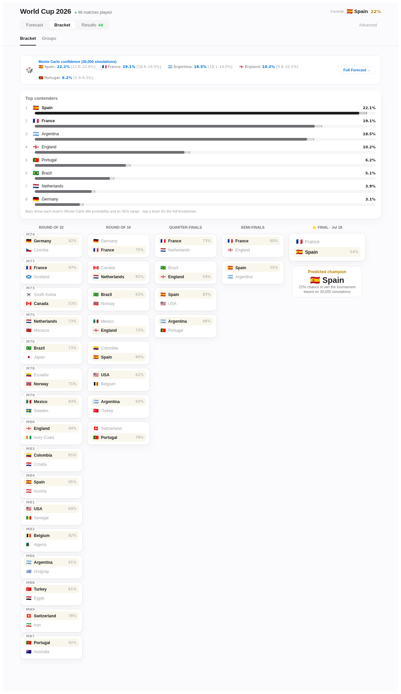
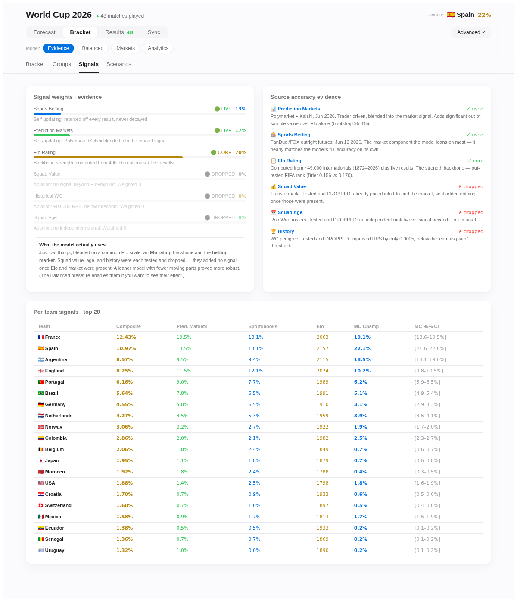
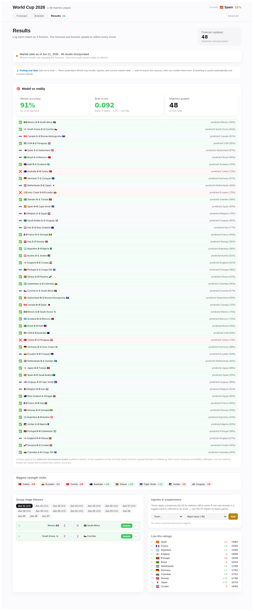
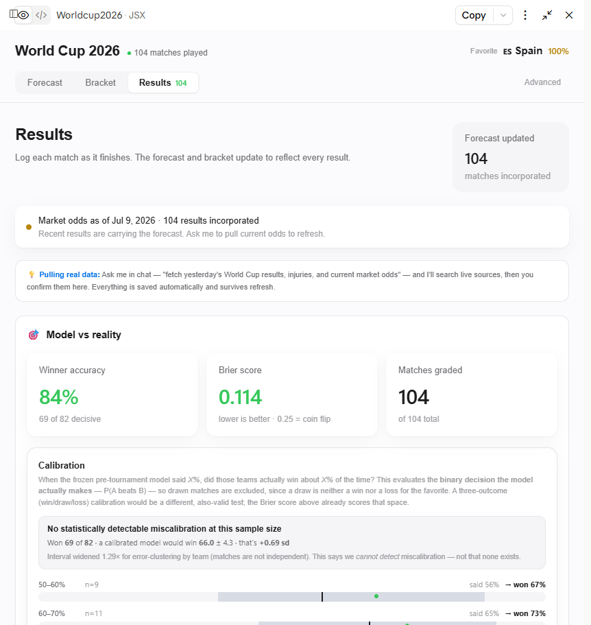
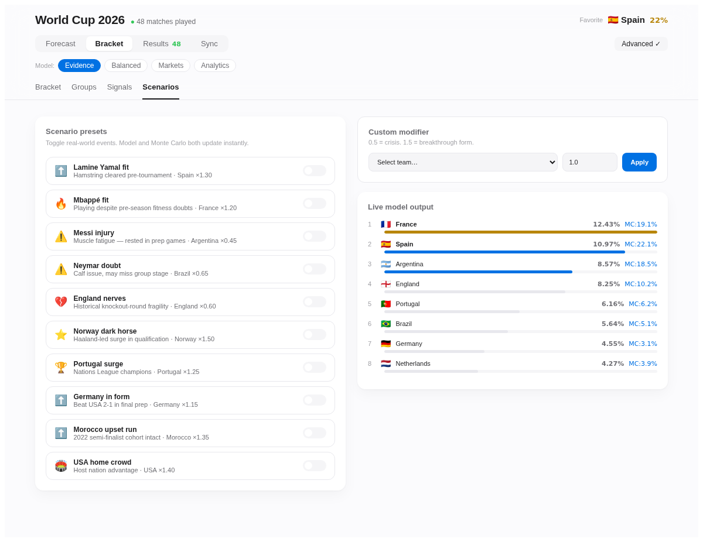
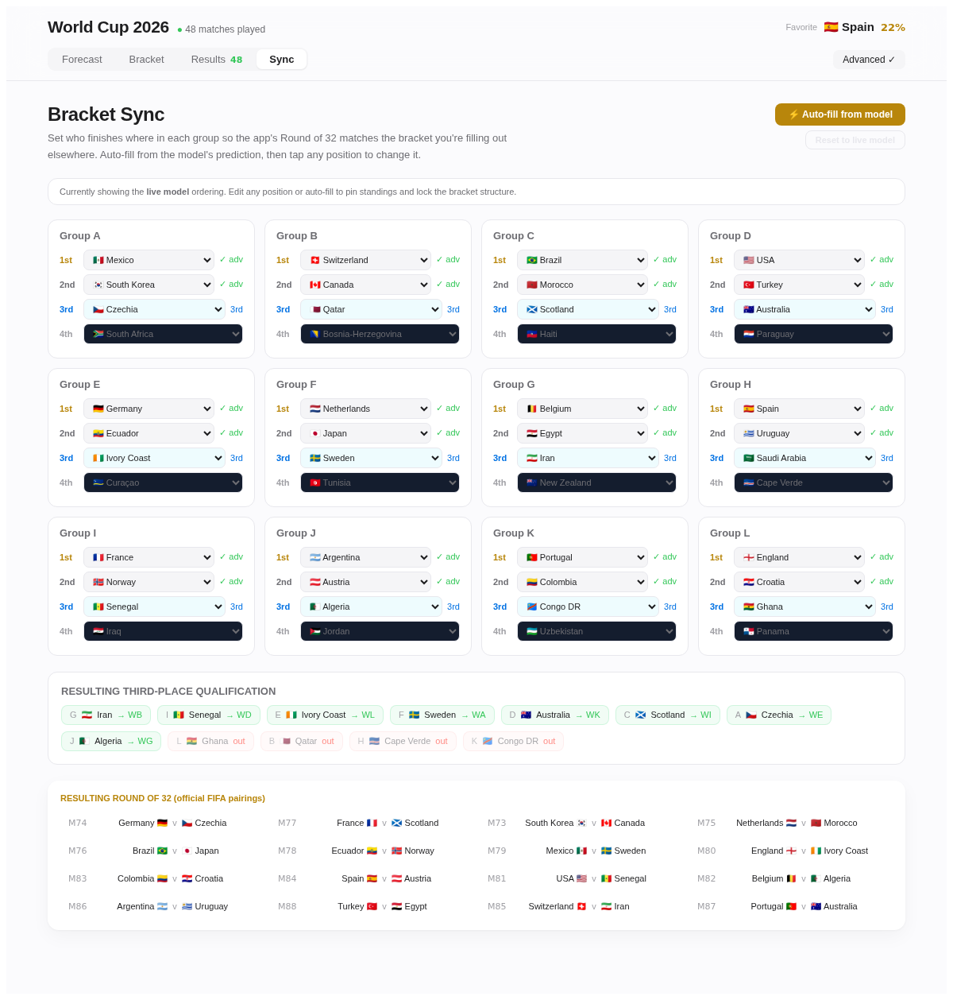

# World Cup 2026 Forecasting Model

I built a probabilistic forecasting system for the 2026 World Cup that combines Elo ratings, market information, a Dixon-Coles goal model, and Monte Carlo simulation—and then built a React application to expose the model's predictions, uncertainty, and live performance. Rather than claiming to beat the betting market, I designed the project around a harder-to-fake question: are its probabilities actually calibrated? Calibration is the more useful question: when this model says a team has a 70% chance of winning, does that team actually win 70% of the time? The model is graded against this claim.

This model blends team-strength signals (Elo plus de-vigged prediction-market and sportsbook odds) with a Dixon-Coles Poisson goal model and a Monte Carlo tournament simulation, producing championship, round-advancement, and per-match probabilities. Built as a single self-contained React application.

The model was run live throughout the tournament — logging every result,
updating its live ratings, and re-forecasting after each matchday — and its
predictions were graded against a **frozen pre-tournament baseline** the
entire way, so its scorecard reflects genuine out-of-sample performance
rather than hindsight.

## Headline result

The model finished the 104-match tournament with:

| Metric | Value |
|---|---|
| Decisive-match accuracy | **69 / 82 (84%)** |
| Brier score | **0.114** |
| Champion prediction | **Spain (final pick 53%) — correct** |
| Calibration | No statistically detectable miscalibration (z = +0.69) |

Its honest one-line summary: **it matches the betting market rather than
beating it.** That's the expected outcome for a transparent model competing
against an efficient market, not a shortfall.

Out-of-sample: Elo + market RPS 0.2006 vs. 0.2082 for Elo alone and 0.2007 for the betting-market benchmark.

## Screenshots

The screenshots below are from June 21, 2026: 48 of 104 matches in, before the field had narrowed. A screenshot from the completed bracket shows a single locked-in outcome; this one shows the model with real uncertainty still on the table, which is closer to what it's actually doing.


*Championship odds at 48 matches played. Spain led at 22%, leaving 78% of the field still live — each team's path through the Round of 32, Round of 16, quarters, semis, and final is broken out separately.*


*The bracket view before the field had narrowed, showing per-match win probabilities for every remaining pairing.*


*What the model actually uses (Elo + market, 70/30) and the ablation evidence for what got tested and dropped — squad value, squad age, and historical World Cup pedigree.*


*Live scoring against the frozen pre-tournament forecast: match-by-match grading and the biggest live Elo shifts so far.*


*The finished scorecard: 69/82 decisive matches correct, Brier 0.114, and the calibration table broken out by confidence bucket.*

Two more, outside the core forecasting loop:


*Scenario presets: toggling real-world events (injuries, fitness doubts, home-crowd effects) reprices the model and Monte Carlo simulation instantly.*


*Bracket Sync: takes the model's own group-stage predictions and auto-fills them into the actual FIFA Round-of-32 pairings, so the bracket view stays structurally correct without hand-entering each matchup.*

## What makes this project worth a look

- **An honest, frozen scorecard.** The live accuracy figure grades the
  *pre-tournament* forecast, not a model that quietly re-fits itself. A bug
  that briefly broke this guarantee is documented in full, including the
  before-and-after numbers. See `docs/model-history.md`.
- **A conditional Monte Carlo.** Once the knockouts begin, the simulation
  continues *from the actual bracket* rather than replaying the tournament
  from scratch, so eliminated teams correctly drop to zero probability. This
  was the single most important fix of the tournament run.
- **An executable specification.** A regression suite of **968 probabilistic
  invariants** (probability mass conservation, monotonicity, bracket
  propagation, determinism) checks that the engine's outputs satisfy the
  mathematical contract a tournament forecast has to hold: probabilities sum
  correctly, eliminated teams drop to zero, and nothing moves backward.
- **A documented bug history.** Every significant fix — the shootout grading
  fix, the withdrawn market-decay experiment, the conditional Monte Carlo,
  the frozen-baseline bug — is written up with what went wrong, why it
  mattered, and what changed. See `docs/model-history.md`.

## How this was built: AI-assisted development

I used Claude as a development tool throughout the project, particularly for implementation, refactoring, and test generation. I retained responsibility for the modeling approach, evaluation design, specification, debugging, and analytical decisions. I independently reviewed the generated implementation and used regression tests and out-of-sample evaluation to verify its behavior.

This was built through an iterative AI-assisted workflow with Claude. I set
the modeling approach (the Elo/market blend, the frozen-baseline evaluation
design, what counted as a bug versus a legitimate design choice), caught and
corrected real errors along the way (a transposed scoreline, a broken
bracket-propagation bug, the frozen baseline silently un-freezing
mid-tournament), and made the calibration and shootout-handling judgment
calls documented in `docs/model-history.md`. Claude wrote and revised the
implementation under that direction.

## Repository layout

```
.
├── README.md                     ← you are here
├── LICENSE
├── worldcup2026.jsx              ← the model + app (single file)
├── docs/
│   ├── methodology.md            ← how the model works
│   ├── validation.md             ← out-of-sample results, calibration, limitations
│   └── model-history.md          ← every mid-tournament bug and fix
├── screenshots/
├── refresh_gapcheck.js           ← lists scheduled matches missing results
├── refresh_verify.js             ← pre-simulation sanity checks
├── refresh_regen.js              ← grades results + regenerates the forecast
└── refresh_tests.js              ← 968-assertion regression suite
```

## Running it

This is a single-file React component, not a scaffolded app. There's no
bundler or `package.json` in this repo, so `npm start` won't work out of the
box. Paste `worldcup2026.jsx` into something that can render a React artifact
(CodeSandbox, an existing Vite/CRA shell) to actually run it.

The tooling scripts are plain Node.js. The tournament is complete, so these
mainly serve to reproduce or re-verify the final numbers rather than to
refresh anything live:

```bash
node refresh_gapcheck.js "Jul 19"   # confirms every match is logged (reports COMPLETE)
node refresh_regen.js 103 30000     # re-grades + re-simulates; reproduces Spain 100%
node refresh_tests.js               # runs the 968-assertion regression suite
```

## A note on scope

This is an independent portfolio project exploring transparent probabilistic forecasting. It is **not** a betting tool and makes no claim to beat the market. Its value is as a worked example of building a probabilistic forecasting system with a defined specification, an honest evaluation methodology, and a test suite that verifies the implementation matches the specification.

See [`docs/methodology.md`](docs/methodology.md) for how the model works and
[`docs/validation.md`](docs/validation.md) for the full results, calibration
analysis, and known limitations.
